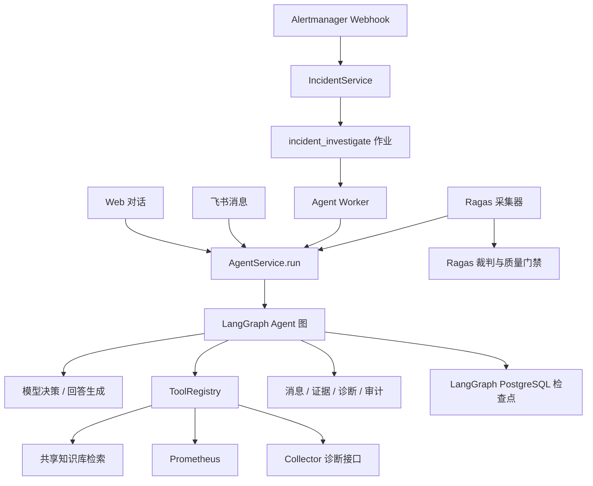
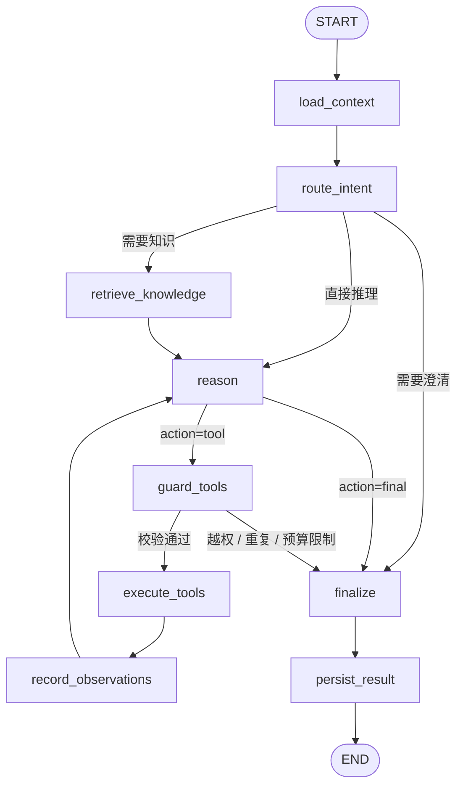
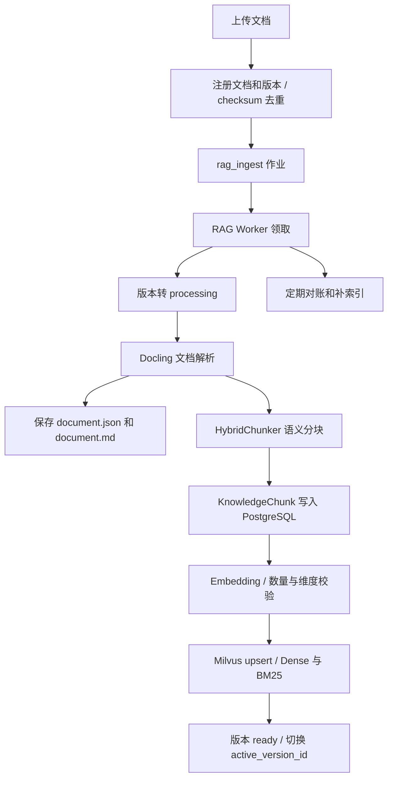
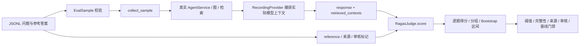

# PulseOps：Agent、知识库、评估与记忆的代码导读

本文围绕当前项目的实际实现，解释 Agent 流程如何编排、知识库如何入库和检索、工具如何调用、状态如何流转、记忆如何管理，以及 Ragas 如何评估问答质量。

核对日期：2026-10-05。基于 `D:/Oncall` 当前工作区，包含未提交代码；核对时 Git HEAD 为 `85fdf92`。代码链接采用本机绝对路径和函数起始行，后续修改代码可能使行号变化，可按文中函数名重新定位。

## 1. 先理解整体架构

项目的 Agent 是一个由 LangGraph 驱动的运维工作流。业务入口创建一次 `AgentRun`，图加载会话与事件上下文，通过规则判断意图，按需检索 SOP，然后让模型决定继续收集证据还是结束回答。模型可以选择工具，执行权由 Python 运行时掌握。

其中有三条相互衔接的链路：

| 链路 | 解决的问题 | 核心实现 |
|---|---|---|
| Agent 运行 | 当前问题需要什么证据、接下来做什么、如何给出结论 | [AgentService.run](D:/Oncall/backend/src/oncall/application/agent_service.py:37)、[OncallGraphRuntime.build](D:/Oncall/backend/src/oncall/agent/graph.py:299) |
| 知识库入库与检索 | 将文档变成可检索片段，为回答提供 SOP 与处置依据 | [KnowledgeIngestor](D:/Oncall/backend/src/oncall/rag/ingestion.py:34)、[KnowledgeRetriever.search](D:/Oncall/backend/src/oncall/rag/retrieval.py:154) |
| 离线评估 | 用固定问题、参考答案和裁判模型验证真实问答质量 | [evaluation.cli](D:/Oncall/backend/src/oncall/evaluation/cli.py:77)、[RagasJudge](D:/Oncall/backend/src/oncall/evaluation/judge.py:50) |

知识库提供相对稳定的运维知识；Prometheus、Collector 和数据库中的事件记录提供当前观测。模型输出把这些依据组织成回答或诊断报告。原始会话、摘要、长期事实和图检查点分别承担不同的记忆职责。



### 1.1 三种业务入口

**Web 对话**从 `POST /api/conversations/{cid}/messages:stream` 进入。接口确认会话归属后，为 Agent 单独创建数据库会话，通过 `emit` 回调把进度、工具事件和正文 token 放入异步队列，再以 SSE 返回前端。代码：[api.main.chat](D:/Oncall/backend/src/oncall/api/main.py:655)。

**飞书消息**经过渠道网关后，同样调用 `AgentService.run`。因此渠道主要负责消息接入和输出，核心推理逻辑共用一套图。调用位置：[feishu_gateway.py](D:/Oncall/backend/src/oncall/channels/feishu_gateway.py:161)。

**自动故障调查**从 Alertmanager Webhook 开始。`IncidentService` 创建或更新事件、会话、证据以及调查作业；Agent Worker 领取 `incident_investigate`，以 `channel="monitor"`、`mode=investigate` 调用 Agent。这个内部触发语句不保存成用户消息，最终诊断作为可见的助手消息保存。代码：[Webhook](D:/Oncall/backend/src/oncall/api/main.py:224)、[事件处理](D:/Oncall/backend/src/oncall/application/incident_service.py:133)、[调查作业入队](D:/Oncall/backend/src/oncall/application/incident_service.py:363)、[Worker](D:/Oncall/backend/src/oncall/workers/agent_worker.py:19)。

### 1.2 AgentService 在图外负责什么

阅读 [AgentService.run](D:/Oncall/backend/src/oncall/application/agent_service.py:37)，可以按下面的顺序理解：

1. 加载会话，确定项目和 Incident。指定 `incident_id_override` 时核对事件对应项目是否属于会话用户。
2. 自动选择模式：关联 Incident 的对话默认是 `follow_up`，其他对话默认是 `chat`；Worker 显式指定 `investigate`。
3. 保存真实用户消息；Web 的显式“记住……”请求走长期记忆分支，可直接保存事实并返回。
4. 创建状态为 `running` 的 `AgentRun`，初始化图输入。
5. 生成 `thread_id`，构建并调用 `graph.ainvoke(initial, config)`。
6. 图完成后估算上下文大小，达到阈值时持久化 `memory_compact` 作业。
7. 捕获失败，更新 `AgentRun`；模型服务异常还会保存失败消息和 Incident 证据。

这里可以看到两个生命周期：`AgentRun` 表示一次执行，`thread_id` 表示能够跨轮保留图检查点的会话线程。

## 2. Agent 流程如何编排

图的完整定义在 [OncallGraphRuntime.build](D:/Oncall/backend/src/oncall/agent/graph.py:299)。共有 9 个业务节点，正常执行最终走到 `persist_result → END`。



### 2.1 每个节点做什么

| 节点 | 输入与处理 | 写回状态 | 代码 |
|---|---|---|---|
| `load_context` | 加载消息、摘要、项目、事件、旧诊断、长期事实；重置本轮临时字段 | 上下文、预算、计数器、空引用与空决策 | [graph.py:330](D:/Oncall/backend/src/oncall/agent/graph.py:330) |
| `route_intent` | 用规则判断意图，生成当轮工具允许列表 | `intent`、各 `requires_*`、`allowed_tools`；澄清时直接写最终决策 | [graph.py:366](D:/Oncall/backend/src/oncall/agent/graph.py:366) |
| `retrieve_knowledge` | 构造检索 query，通过工具注册器搜索知识库 | `knowledge_hits`、引用、检索状态和错误 | [graph.py:403](D:/Oncall/backend/src/oncall/agent/graph.py:403) |
| `reason` | 检查循环预算，构造模型上下文，让模型返回结构化决策 | `decision`、`reason_loops`；耗尽时设置 `exhausted` | [graph.py:454](D:/Oncall/backend/src/oncall/agent/graph.py:454) |
| `guard_tools` | 检查全局工具名单、当轮名单、重复调用和预算 | 待执行的 `pending_tool`，或终止决策 | [graph.py:479](D:/Oncall/backend/src/oncall/agent/graph.py:479) |
| `execute_tools` | 注入执行范围，调用 `ToolRegistry.execute` | `current_tool_result`、调用计数、调用去重键 | [graph.py:508](D:/Oncall/backend/src/oncall/agent/graph.py:508) |
| `record_observations` | 将工具结果转成证据或知识引用；部分事件证据写数据库 | `evidence`、`knowledge_refs`、`answer_sources`；清空临时工具槽 | [graph.py:563](D:/Oncall/backend/src/oncall/agent/graph.py:563) |
| `finalize` | 普通对话生成正文；调查模式生成和校验诊断报告 | `final_response`、`diagnosis`、引用使用状态 | [graph.py:649](D:/Oncall/backend/src/oncall/agent/graph.py:649) |
| `persist_result` | 保存助手消息、诊断和通知记录，结束运行 | 数据库中的消息、诊断、事件和 `AgentRun` 状态 | [graph.py:725](D:/Oncall/backend/src/oncall/agent/graph.py:725) |

节点返回的是状态更新字典。图将这些更新合并到当前 `OncallState`，下一节点读取更新后的状态。列表字段由节点显式复制和追加，具体行为在第 3 节说明。

### 2.2 意图路由由规则决定

[classify_intent](D:/Oncall/backend/src/oncall/agent/router.py:78) 按当前消息、项目、Incident 和模式做第一阶段判断，没有模型调用。规则先后顺序会影响最终结果，例如“当前有哪些未恢复告警”优先走跨项目告警列表，而“这个告警为什么发生”在缺少事件锚点时要求澄清。

| 意图 | 典型触发 | 前置知识检索 | 工具范围 |
|---|---|---|---|
| `casual_chat` | “你好”“你是谁”，或未识别为运维问题 | 否 | 空列表 |
| `ops_qa` | “CPU 持续过高怎么排查” | 是 | `search_knowledge` |
| `project_query` | 已绑定项目，询问当前指标、日志、状态 | 是 | 当前注册的全部工具 |
| `incident_investigation` | 关联事件且模式为 `investigate` | 是 | 当前注册的全部工具 |
| `incident_followup` | 已关联事件，继续询问根因、证据、是否恢复等 | 是 | 当前注册的全部工具 |
| `active_alerts` | “当前有哪些未恢复告警” | 否 | `query_active_alerts` |
| `clarification` | 实时查询缺少项目，或模糊指向某条告警 | 否 | 直接形成澄清回答 |

工具范围在 [route_intent](D:/Oncall/backend/src/oncall/agent/graph.py:366) 写入。`route_confidence` 当前是规则返回的固定值，主要是 `0.9`，闲聊和澄清为 `0.8`，可以用于解释路由，不能当作统计校准后的模型置信度。

`active_alerts` 还存在确定性的执行分支：[reason](D:/Oncall/backend/src/oncall/agent/graph.py:454) 首先要求调用 `query_active_alerts`；已经调用后直接进入最终正文生成，省去这一路径的模型工具选择。

### 2.3 模型如何决定下一步

[AgentDecision](D:/Oncall/backend/src/oncall/domain/schemas.py:57) 只允许两种动作：`tool` 和 `final`。

```json
{
  "action": "tool",
  "rationale": "需要确认过去半小时的 CPU 趋势",
  "tool_name": "query_metric_history",
  "tool_args": {"metrics": ["host.cpu.percent"], "minutes": 30}
}
```

`host.cpu.percent` 是项目支持的指标标识；其他指标同样需要从 [SUPPORTED_SIGNALS](D:/Oncall/backend/src/oncall/monitoring/signals.py:58) 中选择。

模型适配层 [OpenAICompatibleProvider.decide](D:/Oncall/backend/src/oncall/agent/model_gateway.py:374) 将 `SYSTEM_PROMPT + DECISION_SCHEMA` 放入 system 消息，把序列化后的上下文作为 user 消息，请求兼容的 `/chat/completions` 接口。当前通过 JSON 文本约定工具决策，代码再将其解析为 Pydantic 模型。

解析时会清理 JSON 包装、规范诊断列表和知识引用；第一次校验失败后，额外请求模型修复一次 JSON，仍失败则抛出异常。工具执行不依赖模型自由生成的 Python 或 SQL。

提示词分别在 [prompts.py](D:/Oncall/backend/src/oncall/agent/prompts.py)：

- `SYSTEM_PROMPT`：约束证据来源、工具选择、已知与未知、知识引用，以及调查报告要求。
- `DECISION_SCHEMA`：约定结构化决策格式。普通最终回答通常只返回空 `answer`，正文交给后续流式调用。
- `STREAM_ANSWER_PROMPT`：生成给用户阅读的正文，并要求使用已有 `[KB-n]` 引用。

调查模式的模型决策应填写 `diagnosis`；普通对话通常在 `finalize` 通过 [stream_answer](D:/Oncall/backend/src/oncall/agent/model_gateway.py:420) 另行生成正文。模型已经给出非空 `answer`，或规则已经产生澄清/停止信息时，可以直接使用该文本。

### 2.4 如何保证流程收敛

预算常量位于 [graph.py](D:/Oncall/backend/src/oncall/agent/graph.py:38)：

| 模式 | 工具循环预算 | `reason` 循环预算 |
|---|---:|---:|
| `chat` | 5 | 4 |
| `follow_up` | 6 | 5 |
| `investigate` | 10 | 8 |

每次进入 `reason` 都增加计数；超过推理预算，或已用工具次数达到上限，就强制进入最终节点。实际工具次数还受推理循环数限制，因为每次工具执行之后都要重新进入 `reason`。

调用去重键是“工具名 + 按键排序后的参数 JSON”。相同工具和相同参数在同一轮再次被选择，会直接收敛。失败的调用同样占用工具次数，并进入去重列表。

**前置检索的特殊点：** `retrieve_knowledge` 也经过 `ToolRegistry`，会留下审计，但它没有增加 `tool_calls_used`；它会记录 `called_tools`，避免模型用相同参数重复检索。后续由模型发起的 `search_knowledge` 走工具循环并计入预算。

`finalize` 在调查模式缺少诊断时创建一个低置信度的兜底 `DiagnosisReport`，明确写出证据不足和下一步。普通对话遇到模型服务异常则由服务层记录失败并抛出，工具失败与模型失败的处理方式不同。

### 2.5 图外的异步作业如何编排

项目用 PostgreSQL 的 `background_jobs` 表作为持久化队列，由 [JobQueue](D:/Oncall/backend/src/oncall/jobs/queue.py:12) 管理，没有在这里引入 Celery 或 Redis 队列。Agent Worker 消费调查与记忆压缩，RAG Worker 消费入库和重建索引，Notification Worker 独立处理通知发送。

[enqueue](D:/Oncall/backend/src/oncall/jobs/queue.py:16) 支持幂等键以及 `commit=False`，方便调用方把事件与作业放在同一业务事务中。作业优先级数字越小越先执行，当前知识入库通常为 50，记忆压缩为 200。

[claim](D:/Oncall/backend/src/oncall/jobs/queue.py:50) 按作业类型、可执行时间、状态及租约筛选，通过 `FOR UPDATE SKIP LOCKED` 让并发消费者避开已锁定的记录；领取后标记 `running`、增加尝试次数、设置租约。租约默认 120 秒，过期的运行中作业可以再次领取。

[fail](D:/Oncall/backend/src/oncall/jobs/queue.py:87) 未达到尝试上限时将作业回置 `pending`，按“基础延迟 × 已尝试次数”延后；达到默认 5 次上限后置为 `dead`。调查默认基础重试延迟 10 秒，RAG 失败传入 30 秒。成功由 `complete` 标记 `done`。

当前 Worker 代码没有租约心跳续期；若增加多个并行消费者，需要留意长于租约的任务可能被重新领取。持久化队列提供领取和重试机制，运行函数仍需考虑重复执行与幂等性。

## 3. 状态如何定义与流转

### 3.1 图状态 OncallState

完整字段定义在 [state.py:OncallState](D:/Oncall/backend/src/oncall/agent/state.py:6)。它是 `TypedDict(total=False)`：字段可以缺省，主要提供类型约定，不具备 Pydantic 的运行时校验能力。

| 字段组 | 主要字段 | 用途与主要写入方 |
|---|---|---|
| 执行身份 | `run_id`、`mode`、`conversation_id`、`incident_id`、`project_id`、`channel`、`user_message` | 服务层初始化本轮身份、范围和输入 |
| 意图路由 | `intent`、`route_confidence`、`route_reason`、`is_ops_related`、`requires_knowledge`、`requires_project`、`requires_incident`、`requires_realtime`、`clarification_question` | `route_intent` 决定分支和工具可用范围 |
| 记忆与背景 | `working_messages`、`conversation_summary`、`long_term_facts`、`project_context`、`incident_context`、`previous_diagnosis` | `ContextBuilder` 加载消息和数据库上下文 |
| 证据 | `evidence`、`answer_sources` | 历史事件证据、工具观测及回答来源 |
| 收敛控制 | `tool_calls_used`、`tool_budget`、`reason_loops`、`reason_loop_budget`、`called_tools`、`exhausted` | 控制调用数量、重复调用与停止 |
| 决策与工具临时槽 | `decision`、`allowed_tools`、`pending_tool`、`current_tool_result` | `reason → guard → execute → record` 的数据接力 |
| 知识检索 | `knowledge_query`、`knowledge_status`、`knowledge_error`、`knowledge_hits`、`knowledge_refs` | 保存 query、结果及引用 |
| 引用审计 | `retrieved_citations`、`used_citations`、`citation_status` | 区分检索到了什么和回答使用了什么 |
| 最终结果 | `diagnosis`、`final_response`、`force_notification` | 报告、正文和强制通知标记 |
| 当前预留字段 | `hypotheses`、`tool_plan` | `hypotheses` 当前只有定义；`tool_plan` 会初始化为空，但未形成实际计划执行链路 |

这些字段没有声明 `Annotated[..., reducer]`。因此返回同名字段时采用覆盖语义；需要追加列表时，节点自己构造新列表，例如 `[*called_tools, call_key]`。这也是工具循环能够保留此前证据，同时清空本次临时结果的原因。

每轮 `load_context` 会重置调用计数、知识命中、引用、决策、待执行工具和最终结果。历史上下文重新从业务数据库加载，避免沿用上一轮检查点中的工具预算和旧诊断输出。代码：[load_context](D:/Oncall/backend/src/oncall/agent/graph.py:330)。

### 3.2 结构化对象的运行时校验

与 `OncallState` 配套的 Pydantic 模型集中在 [domain/schemas.py](D:/Oncall/backend/src/oncall/domain/schemas.py)：

| 对象 | 关键字段 | 作用 |
|---|---|---|
| `AgentDecision` | `action`、`rationale`、`tool_name`、`tool_args`、`answer`、`diagnosis` | 校验模型决策结构 |
| `ToolResult` | `ok`、`summary`、`data`、`observed_at`、`truncated`、`error_code`、`source_ref` | 统一各种工具的输出格式 |
| `EvidenceItem` | `type`、`source_tool`、`observed_at`、`summary`、`data`、`source_ref` | 把工具输出组织成可追溯观测 |
| `CitationRef` | `citation_id`、文档/版本/分块 ID、标题、页码、分数 | 描述知识来源 |
| `DiagnosisReport` | 症状、证据、根因、置信度、处置、验证、风险、未知项、引用 | 校验最终故障报告；置信度限制在 0 到 1 |

### 3.3 数据库状态与图状态的区别

图状态描述当前执行中的上下文和控制变量；数据库状态描述业务实体的生命周期。相关表在 [models.py](D:/Oncall/backend/src/oncall/infrastructure/db/models.py)，模式和事件枚举在 [enums.py](D:/Oncall/backend/src/oncall/domain/enums.py)。多数数据库状态字段实际存储为字符串。

| 实体 | 主要状态 | 谁推动变化 |
|---|---|---|
| `AgentRun` | `running → completed / failed` | 服务层创建，图持久化完成，异常分支标记失败 |
| `Incident` | `open → investigating → diagnosed → resolved` | Webhook、调查服务、报告持久化和恢复处理；枚举还定义 `failed` |
| `KnowledgeDocument / Version` | `uploaded → processing → ready / failed` | 上传服务与 RAG 入库流程 |
| `BackgroundJob` | `pending → running → done`；失败后回 `pending`，达到上限为 `dead` | `JobQueue` |
| `ToolRun` | `ok / error / timeout` | 工具注册器 |
| `RetrievalTrace` | `ok / error` | 知识检索审计 |

事件恢复和重复触发可能改变或重新开启上述事件流程，完整逻辑见 [incident_service.py](D:/Oncall/backend/src/oncall/application/incident_service.py:133)。模型服务异常发生在调查期间时，当前代码将 `investigating` 回退为 `open`，保存错误证据；这不能理解成所有失败都会把 Incident 置为 `failed`。

`knowledge_status` 是图中的检索结果标记：`skipped` 表示跳过，`hit` 表示有命中，`empty` 表示检索成功但无结果，`unavailable` 表示检索不可用。`citation_status` 则为 `none`、`retrieved_not_cited` 或 `cited`。

## 4. 知识库如何编排

知识库分为异步入库和在线检索。PostgreSQL 保存文档、版本和完整分块，是主要数据依据；Milvus 保存用于检索的派生索引；本地目录保存原文件及 Docling 导出的规范化文件。

### 4.1 上传、解析、分块与索引



具体步骤可以沿下面的代码阅读：

1. [KnowledgeService.upload](D:/Oncall/backend/src/oncall/application/knowledge_service.py:30) 注册版本，入队 `rag_ingest`，幂等键为版本 ID。
2. [register_upload](D:/Oncall/backend/src/oncall/rag/ingestion.py:41) 校验后缀，计算 SHA-256。相同用户与标题对应一个逻辑文档，相同内容 checksum 返回已有版本。原文件存放在 `knowledge_dir / document_id / checksum`。
3. [rag_worker.loop](D:/Oncall/backend/src/oncall/workers/rag_worker.py:17) 领取 `rag_ingest` 或 `knowledge_reindex`，调用 `ingest_version`。
4. [ingest_version](D:/Oncall/backend/src/oncall/rag/ingestion.py:101) 用条件 UPDATE 将允许处理的版本转成 `processing`，然后执行转换。
5. [_convert](D:/Oncall/backend/src/oncall/rag/ingestion.py:261) 使用 `DocumentConverter().convert(path)`，通过 `HybridChunker(merge_peers=True)` 分块，并用 `chunker.contextualize(ch)` 生成带语境的文本。保留标题路径和页码。
6. 分块存入 PostgreSQL 后，调用 Embedding。代码验证返回向量数与分块数一致，并验证每个向量的维度与配置一致。
7. 删除该版本旧索引并 upsert 新索引；更新版本成功后清理此前活动版本的索引，写入 `active_version_id`，将文档与版本标记为 `ready`。
8. 失败时回滚并保存版本 `error`，将相关状态置为 `failed`，再抛出异常供作业队列重试。

当前支持 PDF、DOCX、PPTX、HTML、Markdown、TXT、XLSX 等后缀，清单在 [ingestion.py](D:/Oncall/backend/src/oncall/rag/ingestion.py:23)。分块依赖 Docling 的结构化解析与 HybridChunker，没有在项目中另写固定字符长度切片逻辑。

### 4.2 Milvus 索引怎样组织

[MilvusKnowledgeIndex._ensure_sync](D:/Oncall/backend/src/oncall/rag/milvus_store.py:44) 创建 `oncall_knowledge` collection，保存：

- 标识：`id`、`document_id`、`version_id`。
- 展示与引用信息：`title`、`page_range`、`content`。
- 检索字段：`dense` 稠密向量、`sparse` 稀疏向量。
- 兼容字段：`project_scope`，当前入库值为空字符串。

`dense` 使用 `COSINE`；`sparse` 使用 `SPARSE_INVERTED_INDEX` 和 `BM25`。稀疏向量由 Milvus 的 BM25 Function 从 `content` 生成。

**共享范围需要结合代码理解：**文档管理查询按用户过滤，但 Dense 和 BM25 搜索均使用空 `filter`，Agent 的知识检索参数也没有项目 ID。这实现的是本地工作区共享知识库。若将系统扩展成多租户服务，应重新设计检索隔离；当前检索代码没有租户级过滤条件。定位：[文档列表](D:/Oncall/backend/src/oncall/application/knowledge_service.py:19)、[dense_search](D:/Oncall/backend/src/oncall/rag/milvus_store.py:124)、[bm25_search](D:/Oncall/backend/src/oncall/rag/milvus_store.py:147)。

### 4.3 在线检索：Dense + BM25 + RRF + Rerank

[KnowledgeRetriever.search](D:/Oncall/backend/src/oncall/rag/retrieval.py:154) 的实际顺序是：

```text
query 清理并限制到 1000 字符
    → query Embedding
    → 并发 Dense Top20 与 BM25 Top20
    → 按分块 ID 做 RRF 融合
    → 保留融合后的 Top30 候选
    → 远程 Reranker
    → 默认返回 Top5 主命中
    → PostgreSQL 相邻分块扩展
    → ToolResult
```

RRF 实现在 [rrf](D:/Oncall/backend/src/oncall/rag/retrieval.py:21)，默认 `k=60`：

```text
RRF_score(chunk) = Σ 1 / (60 + 该 chunk 在某一路结果中的排名)
```

融合依据排名，而不是直接相加 Dense 与 BM25 的原始分数。按 ID 去重后，来自两路的同一分块会累计得分。

[Reranker.rerank](D:/Oncall/backend/src/oncall/rag/rerank.py:9) 将 query、候选片段文本和 `top_n` 发送到配置的远程重排接口；根据返回的 `index` 找回候选，附上 `rerank_score`。

### 4.4 为什么要扩展相邻分块

命令、SQL 或连续操作步骤可能跨越分块边界。[_expand_context](D:/Oncall/backend/src/oncall/rag/retrieval.py:75) 根据主命中 ID 找到 PostgreSQL 分块，然后加载同版本、相邻索引的内容，排序组成 `context_text`。

默认 `knowledge_context_radius=1`，因此一个主命中最多扩展前一块、本块、后一块；默认窗口上限是 `2400` 字符。它保持主命中的 ID 和分数，并额外提供 `context_text`、`context_chunk_count`。相邻块不会变成额外的 Milvus 排名结果。配置：[config.py](D:/Oncall/backend/src/oncall/bootstrap/config.py:60)。

Agent 真正发送模型前还会再次裁剪：[graph._context](D:/Oncall/backend/src/oncall/agent/graph.py:218) 对 `knowledge_hits` 限制条数、文本长度，其中长 `content` 限制为 1200 字符，`context_text` 限制为 2400 字符，然后进入总 token 预算控制。

### 4.5 查询构造、降级与引用

普通问题直接用当前消息检索。事件调查则由 [build_knowledge_query](D:/Oncall/backend/src/oncall/agent/graph.py:68) 组合告警名称、事件摘要、非通用触发消息、告警类型对应的领域提示，以及“故障排查 / 处理方案 / 恢复验证”。这样自动调查使用故障信息检索。

| 情况 | 在线处理 | 对 Agent 的影响 |
|---|---|---|
| Embedding 失败 | 返回 `EMBEDDING_UNAVAILABLE` | `knowledge_status=unavailable`，最终正文说明知识检索不可用 |
| Dense/BM25 无候选 | 成功返回空列表 | `knowledge_status=empty`，仍可根据其他依据回答 |
| 重排异常或返回空结果 | 使用 RRF 候选，标记 `rerank_fallback=true` | 可继续给出答案；评估门禁会检查降级标记 |
| 相邻块扩展失败 | 保留原主命中 | 维持检索可用性 |
| 其他检索异常 | 返回 `RAG_UNAVAILABLE` | 记录失败并继续 Agent 流程 |

主命中转换成 `KB-1` 等稳定引用，记录文档 ID、版本 ID、分块 ID、标题、页码、分数和摘录。[_merge_citations](D:/Oncall/backend/src/oncall/agent/graph.py:123) 负责去重与编号；[_citation_metadata](D:/Oncall/backend/src/oncall/agent/graph.py:148) 根据结构化诊断引用或正文中的 `KB-n` 标记，计算实际使用的引用。

这可以追踪“检索到的片段”和“回答标记使用的片段”，但引用使用标记本身不验证回答句子是否被原文充分支持；这部分由评估的 Faithfulness 等指标进一步检查。

### 4.6 索引对账与恢复

[reconcile_index](D:/Oncall/backend/src/oncall/rag/ingestion.py:229) 读取 PostgreSQL 中的活动版本 ID，与 Milvus 中的版本清单对比，删除多余索引，对缺失版本重新入库。RAG Worker 启动后及每隔约 300 秒执行对账，外层异常会记录日志并继续循环。

需要准确理解其范围：当前对账以“版本 ID 是否存在”为单位，未逐块比较向量数量、内容或校验和，因此它能够修复整版本缺失，不能据此推断所有部分分块缺失都能被发现。

## 5. 工具如何调用

### 5.1 当前 8 个只读工具

模型可见工具规格定义在 [TOOL_SPECS](D:/Oncall/backend/src/oncall/agent/tool_contracts.py:25)，实际执行映射位于 [ToolRegistry._dispatch](D:/Oncall/backend/src/oncall/agent/tool_registry.py:328)。

| 工具 | 数据来源与用途 | 具体实现 |
|---|---|---|
| `query_active_alerts` | 从 PulseOps 数据库查询当前用户全部项目的未恢复事件 | [_active_alerts](D:/Oncall/backend/src/oncall/agent/tool_registry.py:146) |
| `query_incident_context` | 当前事件、已有证据和项目最近接收的 Alertmanager 告警 | [_incident_context](D:/Oncall/backend/src/oncall/agent/tool_registry.py:185) |
| `query_current_metrics` | 通过项目范围内的 PromQL 查询当前指标 | [_current_metrics](D:/Oncall/backend/src/oncall/agent/tool_registry.py:272) |
| `query_metric_history` | 查询指标历史时间序列 | [_metric_history](D:/Oncall/backend/src/oncall/agent/tool_registry.py:299) |
| `search_logs` | 调用 Collector 日志接口，支持筛选和错误特征聚合 | [observability.search_logs](D:/Oncall/backend/src/oncall/integrations/observability.py:121) |
| `query_database_health` | 调用 Collector PostgreSQL 诊断接口 | [observability.query_database](D:/Oncall/backend/src/oncall/integrations/observability.py:185) |
| `query_runtime_resources` | 调用 Collector 检查容器、资源、重启、OOM、进程、端口 | [observability.query_runtime_resources](D:/Oncall/backend/src/oncall/integrations/observability.py:207) |
| `search_knowledge` | 检索工作区共享知识库 | [KnowledgeRetriever.search](D:/Oncall/backend/src/oncall/rag/retrieval.py:154) |

Collector 接口分别是 `/v1/logs/search`、`/v1/database/diagnose`、`/v1/runtime/diagnose`，实现位于 [collector/app.py](D:/Oncall/backend/src/oncall/collector/app.py:292)。这些工具收集诊断数据，不提供自动重启、写 SQL 或杀进程的执行入口。

历史指标工具规格描述了统计和趋势，但当前 `_metric_history` 实际返回 Prometheus 时间序列及逐指标错误，没有在该函数中显式计算均值、最大值或趋势。讲解行为应以执行函数为准。

### 5.2 调用链和控制边界

```text
模型返回 AgentDecision(action="tool")
    → guard_tools：全局名单 + 当轮名单 + 去重 + 预算
    → execute_tools：注入 ToolExecutionContext
    → ToolRegistry.execute：参数校验 + 超时 + 异常处理
    → _dispatch：映射到具体实现
    → ToolResult
    → 审计 ToolRun / RetrievalTrace
    → record_observations：证据或知识引用
    → reason：基于新观测继续决策
```

[ToolExecutionContext](D:/Oncall/backend/src/oncall/agent/tool_registry.py:37) 包含 `project_id`、`incident_id` 和 `agent_run_id`。这些值来自运行时，未开放为模型参数，因此模型不能通过 `tool_args` 指定其他项目或事件。`search_knowledge` 和 `query_active_alerts` 可以在未绑定项目时调用，其余工具要求项目。

[validate_tool_args](D:/Oncall/backend/src/oncall/agent/tool_contracts.py:188) 检查必填参数、类型、枚举、数值范围、数组长度、数组重复项，以及未知参数。例如历史查询的 `minutes` 必须是 5 到 10080 的整数，知识检索 `top_k` 必须是 1 到 10。

完整执行层在 [ToolRegistry.execute](D:/Oncall/backend/src/oncall/agent/tool_registry.py:48)：默认用 `asyncio.wait_for` 限制整个分派为 15 秒，异常转成失败 `ToolResult`，返回 `INVALID_TOOL_ARGS`、`TIMEOUT`、`TOOL_ERROR` 等错误码。Embedding、重排或 Collector 自身的 HTTP timeout 即使更长，也仍会受到这层外部总超时影响。

### 5.3 工具结果如何变成证据

[record_observations](D:/Oncall/backend/src/oncall/agent/graph.py:563) 对结果分两种处理：

- 知识检索结果合并进 `knowledge_refs`，并生成检索进度事件。
- 其他结果包装为 `EvidenceItem`，加入 `evidence`；同时追加工具名、成功标记和观测时间到 `answer_sources`。

成功的非知识工具结果在当前事件仍存在且不是告警列表意图时，还会写入 `IncidentEvidence`。失败结果也进入图中的观测，供模型知道本次检查没有成功，但不作为成功工具证据写入事件。

**后续知识检索的实现边界：**模型在工具循环里再次调用 `search_knowledge` 后，该节点主要更新引用，没有同步替换 `knowledge_hits`、`knowledge_query` 和 `knowledge_status`。因此初次检索保留完整命中，后续命中主要通过引用摘录进入模型上下文。查看代码或分析评估日志时需要留意这一区别。

### 5.4 如何审计

`ToolRun` 保存运行 ID、工具名、参数 SHA-256、状态、摘要、耗时、结果大小、截断标记和错误码；`RetrievalTrace` 额外保存 query、命中数与来源引用。表定义：[ToolRun](D:/Oncall/backend/src/oncall/infrastructure/db/models.py:372)、[RetrievalTrace](D:/Oncall/backend/src/oncall/infrastructure/db/models.py:514)。

审计采用尽力保存策略，处理父运行被并发删除的情形。全局工具未授权或缺少项目在执行层提前返回，发生于完整审计路径之前；因此不能把“每次拒绝调用都有 ToolRun”当作当前保证。

## 6. 记忆如何管理

### 6.1 四类信息及其存储

| 类型 | 存储 | 何时读写 | 作用 |
|---|---|---|---|
| 原始会话消息 | PostgreSQL `messages` | 每轮真实消息和最终助手结果 | 完整历史与追溯 |
| 滚动摘要 + 未压缩尾部 | `conversation_summaries` + 摘要边界之后的消息 | 构造上下文和异步压缩 | 控制长期对话输入大小 |
| 显式长期事实 | `memory_facts` | 用户 Web “记住……”或记忆管理接口 | 跨 Web 会话复用用户偏好/项目事实 |
| 图执行检查点 | LangGraph PostgreSQL checkpoint 表 | 图节点执行期间 | 保存线程中的图状态 |

表结构：[Message](D:/Oncall/backend/src/oncall/infrastructure/db/models.py:294)、[ConversationSummary](D:/Oncall/backend/src/oncall/infrastructure/db/models.py:308)、[MemoryFact](D:/Oncall/backend/src/oncall/infrastructure/db/models.py:322)。Incident 的证据和旧诊断也会被重载为事件背景，但不写成用户长期事实。

### 6.2 上下文如何组装

[ContextBuilder.build](D:/Oncall/backend/src/oncall/agent/context_builder.py:29) 用 `asyncio.gather` 并发读取消息、项目、Incident 和长期事实。各读取任务使用独立数据库会话，避免多个并发查询共享同一 AsyncSession。

普通会话加载最新摘要和摘要覆盖边界之后的消息。边界记录为 `through_message_id`，查询使用消息的 `(created_at, id)` 顺序，确保摘要覆盖的旧消息不再次进入未压缩尾部。代码：[messages_after_summary](D:/Oncall/backend/src/oncall/application/conversation_service.py:79)。

普通会话并非固定只取最近 30 条：当前实现读取摘要之后的全部未压缩消息，再由总输入预算进行控制。只有运维主会话里的指定 Incident 追问采用专门的最近消息窗口。

### 6.3 Token 预算与压缩触发

默认配置在 [config.py](D:/Oncall/backend/src/oncall/bootstrap/config.py:32)：

| 配置 | 默认值 | 含义 |
|---|---:|---|
| `memory_context_window_tokens` | 64000 | 配置的模型上下文窗口 |
| `memory_compact_at_tokens` | 44800 | 自动入队压缩的阈值 |
| `memory_input_hard_limit_tokens` | 48000 | 发给模型前的输入上限 |
| `memory_recent_tokens` | 4000 | 自动压缩时保留的完整近期轮次预算 |
| `memory_summary_tokens` | 1500 | 摘要预算 |
| `memory_facts_tokens` | 500 | 注入长期事实的总预算 |
| `memory_post_compact_tokens` | 6400 | 配置校验中的记忆预算约束 |

这些值都是代码默认值，运行环境可以覆盖。`memory_post_compact_tokens` 当前用于验证近期消息、摘要与长期事实预算之和，不是对包含知识和工具证据的完整 prompt 逐次裁剪到 6400 token。

[count_tokens](D:/Oncall/backend/src/oncall/application/memory_policy.py:23) 优先使用配置的 tokenizer；模型为 `mimo-v2.6-flash` 时可使用项目自带 tokenizer；其他情况下保守估算为 UTF-8 字节数除以 2 向上取整。

Agent 完成当前结果后，[AgentService.run](D:/Oncall/backend/src/oncall/application/agent_service.py:129) 估算模型上下文、系统提示词和本轮助手回答大小，达到 44800 时入队 `memory_compact`。压缩模型调用由 Agent Worker 在后台执行。

发模型前另有硬限制：[graph._fit_context](D:/Oncall/backend/src/oncall/agent/graph.py:268) 按顺序移除知识命中、较旧证据、较旧工作消息，然后缩短摘要；必要输入仍超过预算时抛出异常。这一层保障发送限制，也意味着回答模型实际看到的内容可能少于最初加载的内容。

### 6.4 滚动摘要如何更新

[ConversationMemoryService.compact_if_needed](D:/Oncall/backend/src/oncall/application/memory_service.py:104) 实现以下过程：

1. 读取最新摘要和摘要边界后的未压缩消息，过滤事件消息；运维主会话还过滤带 Incident 标记的消息。
2. 自动模式先判断压缩阈值，再按完整对话轮次拆成“旧消息”和“近期消息”。拆分函数：[take_recent_whole_turns](D:/Oncall/backend/src/oncall/application/memory_policy.py:44)。
3. 将旧摘要与旧消息交给模型合并。旧历史按最多约 10000 token 的连续批次处理，摘要强调目标、事实、检查、结论和未解决问题。
4. 空摘要直接拒绝；过长摘要再请求压缩，仍过长时尝试在完整句子边界截取，否则保留原文并报错。
5. 模型返回后，对会话加行锁，核对是否已被另一 Worker 更新摘要，避免提交过时边界。
6. 新建摘要行，`through_message_id` 指向本次已压缩的最后一条旧消息；原始消息全部保留。

`force=True` 可以手动压缩。若近期尾部尚未达到常规 4000-token 窗口，但至少有 128 token，会压缩这段短尾部，并使用更小的摘要预算。具体摘要逻辑：[memory_service._summarize](D:/Oncall/backend/src/oncall/application/memory_service.py:61)。

### 6.5 长期记忆如何保存、检索与遗忘

[explicit_fact](D:/Oncall/backend/src/oncall/application/long_term_memory.py:19) 识别“记住 / 请记住”前缀。内容为空、超过 500 token，或脱敏检测发现敏感凭据时拒绝保存。

[AgentService.run](D:/Oncall/backend/src/oncall/application/agent_service.py:37) 只对 Web 消息启用这个快捷分支。事实中包含“本项目 / 这个项目”且会话有绑定项目时，保存为项目事实；其他保存为用户事实。该分支直接确认保存，不启动完整 Agent 图。`remember` 对相同用户、相同项目范围、相同有效内容做去重，并记录来源消息 ID。

[LongTermMemoryService.relevant](D:/Oncall/backend/src/oncall/application/long_term_memory.py:82) 的检索方式是轻量词匹配：从问题提取中文双字词和英文/数字词，按这些词在事实内容中的出现情况排序；“我偏好 / 回答时 / 回复时”类事实允许没有关键词命中。最终最多取 8 条，受总 token 预算约束。

这里没有用 Milvus 或向量检索长期记忆，也没有自动从所有对话中抽取事实。[_load_facts](D:/Oncall/backend/src/oncall/agent/context_builder.py:58) 只向 Web 对话注入长期事实；飞书、监控调查和 `evaluation` 渠道返回空事实列表。

[forget](D:/Oncall/backend/src/oncall/application/long_term_memory.py:112) 将 `active=False`，实现软删除，后续读取不再选择该事实。

### 6.6 多告警如何避免串上下文

运维主会话 `type="ops"` 可能聚合多条告警。指定事件追问时，有两层隔离：

- **消息层：**[_load_messages](D:/Oncall/backend/src/oncall/agent/context_builder.py:69) 仅查询 `metadata.incident_id` 与当前事件一致的用户和助手消息，取最近 30 条后按完整轮次保留近期窗口，不使用主会话摘要。
- **检查点层：**[AgentService.run](D:/Oncall/backend/src/oncall/application/agent_service.py:118) 使用 `conversation_id:incident:incident_id` 作为线程 ID。普通对话使用 `conversation_id`。

主会话的通用消息加载及摘要压缩也会过滤带 Incident ID 的消息和事件消息，让通用对话与具体告警追问保有明确范围。

### 6.7 检查点怎样工作

API 和 Agent Worker 分别初始化 `AsyncPostgresSaver` 并执行 `setup()`，再传给 `graph.compile(checkpointer=...)`。定位：[API 启动](D:/Oncall/backend/src/oncall/api/main.py:118)、[Worker 初始化](D:/Oncall/backend/src/oncall/workers/agent_worker.py:19)。初始化失败时记录错误，允许无检查点模式运行。

检查点保存图执行状态，业务数据库保存可查询的消息、证据、摘要和报告。当前调用路径每次使用 `ainvoke(initial, config)` 从输入启动，未展示通过恢复命令精确续跑失败节点的逻辑，因此“已有持久化检查点”不能等同于“作业重试自动从失败节点续跑”。

## 7. Ragas 如何评估

### 7.1 评估的是哪条路径

评估入口为 [evaluation.cli](D:/Oncall/backend/src/oncall/evaluation/cli.py:319)，依赖在 [pyproject.toml](D:/Oncall/pyproject.toml) 的 `evaluation` extra，锁定 Ragas `0.4.3`。

采集复用当前 Agent 运行代码，覆盖意图路由、知识检索、相邻分块、输入裁剪和回答生成。默认是**独立用户、独立归档会话、无项目/Incident 的单轮共享知识库问答**；没有为评估 Agent 注入 checkpointer，且 `channel="evaluation"` 不读取 Web 长期记忆。这些分数的适用范围是知识问答，不直接代表多轮记忆、实时故障诊断或通知交付质量。



### 7.2 参考数据集如何定义

[EvalSample](D:/Oncall/backend/src/oncall/evaluation/dataset.py:10) 定义每道题：

| 字段 | 含义 |
|---|---|
| `id` | 唯一样本 ID |
| `user_input` | 发给 Agent 的问题 |
| `reference` | 裁判使用的参考答案 |
| `reference_contexts` | 支持参考答案的原文证据；可回答题必须提供 |
| `expected_answerable` | 是否应由知识库回答；默认 `true` |
| `reviewed` | 是否已人工审核；默认 `false` |
| `category`、`question_type`、`tags` | 分组统计与题型标记 |
| `source_titles`、`source_document_ids`、`source_version_ids`、`source_pages` | 标准答案的文档来源与版本绑定 |

数据读取拒绝未知字段、空问题、空参考答案、重复 ID 和缺少证据的可回答题。当前文件核对结果：

| 文件 | 题数 | 不可回答题数 | 已审核题数 |
|---|---:|---:|---:|
| [runbooks.jsonl](D:/Oncall/evaluation/datasets/runbooks.jsonl) | 36 | 0 | 0 |
| [edge_cases.jsonl](D:/Oncall/evaluation/datasets/edge_cases.jsonl) | 6 | 3 | 0 |
| [knowledge.jsonl](D:/Oncall/evaluation/datasets/knowledge.jsonl) | 42 | 3 | 0 |

默认 `knowledge.jsonl` 包含合并后的 42 题，当前全部为未审核草稿。可以采集和评分，但正式门禁会因未审核而失败。

自动题目生成使用 [generate_dataset](D:/Oncall/backend/src/oncall/evaluation/generate.py:27)：从活动文档的真实分块生成问题、参考答案和原文引用，验证引用经过 Unicode/空白规范化后确实包含在原文中，最多尝试 3 次。生成结果仍保留 `reviewed=false`。该逻辑使用 Ragas 结构化 LLM 接口，没有建立 Ragas 知识图谱，也没有直接调用完整 TestsetGenerator。

### 7.3 如何采集真实回答与上下文

[collect_sample](D:/Oncall/backend/src/oncall/evaluation/collector.py:131) 创建独立会话，给模型套一层 [RecordingProvider](D:/Oncall/backend/src/oncall/evaluation/collector.py:47)，然后调用 `AgentService.run`。

`RecordingProvider` 记录每次决策及最终正文生成时的模型输入，优先选择最终回答使用的上下文。`retrieved_contexts` 由 [context_passages](D:/Oncall/backend/src/oncall/evaluation/collector.py:30) 从该上下文提取：

- 合并命中的 `content` 和 `context_text`。
- 补入裁剪后仍保留的引用摘录。
- 记录最终实际回答、完整模型输入、原始命中、引用、检索 query、延迟和重排降级标记。

因此评分使用的是**模型实际收到的裁剪后证据**。数据集中的 `reference` 不传入 Agent；它在评分阶段交给裁判。`reference_contexts` 用于维护标准答案证据，当前五个 Ragas 指标的评分参数并不会直接读取该字段。

采集失败、回答为空或知识检索不可用会把样本标记为 `failed`。若整题超时取消，还会清理对应仍为 `running` 的 AgentRun，将其置为失败，避免留下悬挂审计记录。

### 7.4 裁判配置和评分调用

[RagasJudge.__init__](D:/Oncall/backend/src/oncall/evaluation/judge.py:51) 通过 `llm_factory` 构造裁判，温度为 0；Answer Relevancy 额外通过 `embedding_factory` 构造 Embedding。

裁判支持 `.env.ragas` 中的独立配置 `RAGAS_JUDGE_MODEL / BASE_URL / API_KEY`，三项必须完整；全部留空时使用应用当前模型，但采用单独客户端，并在 metadata 中记录是否与回答模型相同。Mock 模型不能作为真实质量裁判。

[score](D:/Oncall/backend/src/oncall/evaluation/judge.py:144) 对每道题按指标逐个执行，通过检查 `metric.ascore` 的函数签名，从样本记录提取其实际需要的字段。每项设置独立超时，保留 `value`、`reason`、`traces`；异常或非有限数值记为 `null` 和 `metric_errors`。

### 7.5 五个核心指标与拒答指标

指标映射直接位于 [judge.py](D:/Oncall/backend/src/oncall/evaluation/judge.py:51)，阈值来自 [thresholds.json](D:/Oncall/evaluation/thresholds.json)。下表的评分含义同时核对了本地已安装的 Ragas 0.4.3 实现。

| 项目指标 | Ragas 实现 | 实际输入 | 如何评分 | 默认门槛 |
|---|---|---|---|---:|
| `context_precision` | `ContextPrecisionWithReference` | 问题、参考答案、实际上下文 | 裁判判断每个片段是否支持参考答案，再计算强调排序的 Average Precision | 0.70 |
| `context_recall` | `ContextRecall` | 问题、参考答案、实际上下文 | 参考答案中的声明能够归因于上下文的比例 | 0.80 |
| `faithfulness` | `Faithfulness` | 问题、实际回答、实际上下文 | 将回答拆成声明，计算上下文能支持的声明比例 | 0.90 |
| `answer_relevancy` | `AnswerRelevancy(strictness=3)` | 问题、实际回答 | 从回答生成问题，与原问题比较 Embedding 余弦相似度；考虑回避回答标记 | 0.80 |
| `factual_correctness` | `FactualCorrectness(mode="f1", atomicity="high", coverage="high")` | 实际回答、参考答案 | 双向拆解并验证事实，使用 TP/FP/FN 计算 F1 | 0.80 |
| `safe_abstention` | 项目扩展的结构化 LLM 裁判 | 问题、参考期望、实际回答 | 判断是否明确承认知识不足、没有编造细节或声称执行动作；通过为 1，失败为 0 | 1.00 |

核心指标的计算关系可写为：

```text
Context Precision = Σ(Precision@i × relevant_i) / Σ relevant_i
Context Recall    = 参考答案中被上下文支持的声明数 / 参考声明数
Faithfulness      = 回答中被上下文支持的声明数 / 回答声明数
Factual F1        = 2TP / (2TP + FP + FN)，默认 beta=1
```

Ragas 的事实正确性把回答声明相对参考答案的支持情况计为 TP/FP，再把参考声明中无法由回答支持的部分计为 FN。它衡量参考事实的一致性与覆盖，Faithfulness 衡量检索证据支持程度，两者能够暴露不同问题。

举例：SOP 明确要求“先检查采集链路，缺失值不能视为零”。如果回答给出“缺失按零处理并重启全部服务”，其证据支持度和事实正确性都会下降；如果回答正确但省略部分必要验证步骤，事实覆盖也可能下降。这是说明指标用途的示例，未在本文中生成项目实测分数。

本地指标源码可进一步阅读：[Context Precision](D:/Oncall/.venv/Lib/site-packages/ragas/metrics/collections/context_precision/metric.py:81)、[Context Recall](D:/Oncall/.venv/Lib/site-packages/ragas/metrics/collections/context_recall/metric.py:82)、[Faithfulness](D:/Oncall/.venv/Lib/site-packages/ragas/metrics/collections/faithfulness/metric.py:88)、[Answer Relevancy](D:/Oncall/.venv/Lib/site-packages/ragas/metrics/collections/answer_relevancy/metric.py:93)、[Factual Correctness](D:/Oncall/.venv/Lib/site-packages/ragas/metrics/collections/factual_correctness/metric.py:114)。这些为本机依赖路径，不是仓库自有代码。

### 7.6 空结果、失败与不可回答题怎样评分

这部分对解释报告很关键，代码在 [RagasJudge.score](D:/Oncall/backend/src/oncall/evaluation/judge.py:144)：

- 对可回答题，检索上下文为空时，Precision 和 Recall 显式记为 `0`，表示真实检索缺失。
- 同样为空时，Faithfulness 未定义，记为 `null` 和错误信息，不能把它算成通过。
- 流水线失败的样本不调用指标裁判，记录无有效分数。
- 不可回答题只评 `safe_abstention`，不混入五个正向指标的均值。
- 可回答题跳过 `safe_abstention`。
- 如果数据包含不可回答题，CLI 会自动把 `safe_abstention` 加入评分指标列表。

这避免了对“知识不足”的问题强求召回，也避免用错误、超时或 NaN 稀释失败。

### 7.7 报告、版本固定与门禁

[cli.collect](D:/Oncall/backend/src/oncall/evaluation/cli.py:77) 保存 dataset hash、活动语料 snapshot/hash、运行配置、代码内容 hash、Git revision、Ragas 版本等；采集结束后再次检查语料、配置和代码是否改变。

[report_data](D:/Oncall/backend/src/oncall/evaluation/report.py:51) 汇总均值、最小值、有效样本数，以及 500 次固定随机种子 Bootstrap 得到的近似 95% 区间；同时按 `category` 和 `question_type` 分组。

正式门禁检查：

1. 样本非空，采集期间快照未变化。
2. 五项核心指标齐全。
3. 没有流水线失败。
4. 所有可回答题绑定的来源可用；未绑定来源会得到 `None`，同样阻止通过。
5. 所有参考题经过人工审核。
6. 没有 `rerank_fallback`。
7. 每项适用指标都有完整有效分数，均值达到阈值。
8. 若比较基线，基线本身通过，数据集、语料、指标、裁判和指标提示词 hash 一致，单项均值下降不超过默认 `0.03`。

基线比较没有要求回答模型或整个 pipeline hash 相同，允许比较修改后的候选实现；评分口径、语料和题集则必须一致。续跑检查更严格：采集续跑要求语料、代码和运行配置匹配，评分续跑要求裁判及指标配置匹配。

输出文件包括 `manifest.json`、`samples/`、`collected.json`、`scored/`、`report.json`、`report.md`、`scores.csv`，默认目录是项目的 `output/evaluation/`。`--gate` 在门禁失败时返回退出码 `2`；未设置该参数时仍生成 FAIL 报告，但不会仅因门禁失败返回 2。定位：[cli.score](D:/Oncall/backend/src/oncall/evaluation/cli.py:154)、[save_report](D:/Oncall/backend/src/oncall/evaluation/report.py:219)。

### 7.8 如何实际运行

在 `D:/Oncall` 执行。以下命令是使用说明，本次文档编写未发起真实模型评估。

```powershell
# 校验题集结构
uv run --no-sync python -m oncall.evaluation validate

# 检查语料、真实检索、重排、裁判及 Embedding 连通性
uv run --no-sync python -m oncall.evaluation doctor

# 用合成的正确/错误答案验证裁判方向
uv run --no-sync python -m oncall.evaluation calibrate --output output/evaluation/judge-calibration.json

# 小批次执行真实 Agent 采集和评分
.\scripts\evaluate-rag.ps1 -Limit 3 -Output output/evaluation/smoke

# 完整采集、评分和门禁
.\scripts\evaluate-rag.ps1 -Output output/evaluation/release -Gate

# 已采集结果可单独重新评分
uv run --no-sync python -m oncall.evaluation score --run-dir output/evaluation/release
```

运行需有 `evaluation` 依赖、PostgreSQL、Milvus、回答模型、Embedding、重排和裁判配置。默认每题 Agent 超时 240 秒，裁判每项超时 120 秒，采集并发默认 1。正式门禁前还需审核数据集并确认对应语料已入库。

[preflight](D:/Oncall/backend/src/oncall/evaluation/preflight.py:19) 检查服务；[calibrate](D:/Oncall/backend/src/oncall/evaluation/calibration.py:9) 只验证裁判能否区分明显正确与错误的合成回答，不代表项目真实问答质量。完整运行说明见 [RAG_EVALUATION.md](D:/Oncall/docs/RAG_EVALUATION.md)。

## 8. 用三个具体场景串起代码

### 8.1 “CPU 持续过高怎么排查”

1. Web 接口调用 `AgentService.run`，未关联事件，采用 `chat`。
2. `load_context` 加载普通会话摘要、未压缩消息，以及相关 Web 长期事实。
3. `classify_intent` 判断为 `ops_qa`，无需项目，前置检索知识库。
4. query 经 Embedding、Dense/BM25、RRF、重排和相邻块扩展后写入 `knowledge_hits`。
5. `reason` 将裁剪后的背景和知识交给模型；当证据足够，返回 `final`。
6. `finalize` 生成处理思路，标记已使用的 `[KB-n]`；`persist_result` 保存正文、引用和运行状态。

如果问的是“本项目当前 CPU 多少”，路由会根据实时标记要求绑定项目，并开放实时工具，数据必须来自工具观测。

### 8.2 自动收到 PostgreSQL 连接告警

1. Webhook 经 `IncidentService` 记录事件和原始告警证据，入队调查作业。
2. Worker 领取作业，`AgentService` 将事件转为 `investigating`，创建调查运行。
3. 图加载事件、历史证据和旧诊断，并路由到 `incident_investigation`。
4. 前置知识检索使用告警名称与摘要构造 PostgreSQL 排查 query。
5. 模型按提示优先确认 `query_incident_context`，然后按新证据选择指标趋势、数据库或日志工具；具体工具次序由模型逐轮决定，预算和白名单由图控制。
6. `finalize` 校验 `DiagnosisReport` 并渲染报告。
7. `persist_result` 保存诊断和助手消息，对未恢复事件标记 `diagnosed`，创建通知记录。
8. 独立 Notification Worker 负责发送通知，调查本身不阻塞最初告警发送。定位：[notification_worker.py](D:/Oncall/backend/src/oncall/workers/notification_worker.py:14)。

### 8.3 用 Ragas 判断这套知识问答是否可靠

1. 数据集准备独立的“问题、参考答案、原文证据与来源”，审核参考答案。
2. `collect` 创建专用评估用户和每题独立会话，发送 `user_input`。
3. Agent 走正常路由和检索流程，`RecordingProvider` 捕获最终回答所用上下文。
4. `score` 将实际回答、实际上下文和参考答案交给各 Ragas 指标。
5. 如果 Recall 低，优先分析 query、分块、召回和重排；如果 Faithfulness 低，检查回答是否超出给定证据；如果 Factual Correctness 低，检查与参考事实的一致性和覆盖。
6. 报告对缺失分数、未审核来源、重排降级及质量回退给出门禁失败原因。

上述排查方向是根据指标定义得出的诊断建议，不能仅靠单个分数断定某模块一定有故障，需要结合逐题上下文和 trace 查看。

## 9. 继续阅读与验证入口

建议按以下顺序直接阅读代码：

| 阅读顺序 | 文件与关键位置 | 重点 |
|---|---|---|
| 1 | [agent_service.py:37](D:/Oncall/backend/src/oncall/application/agent_service.py:37) | 模式、范围、运行初始化与图调用 |
| 2 | [state.py:6](D:/Oncall/backend/src/oncall/agent/state.py:6) | 所有图状态字段 |
| 3 | [graph.py:299](D:/Oncall/backend/src/oncall/agent/graph.py:299) | 节点、边与完整循环 |
| 4 | [router.py:78](D:/Oncall/backend/src/oncall/agent/router.py:78) | 确定性意图路由 |
| 5 | [tool_contracts.py:25](D:/Oncall/backend/src/oncall/agent/tool_contracts.py:25)、[tool_registry.py:48](D:/Oncall/backend/src/oncall/agent/tool_registry.py:48) | 工具规格、执行边界和审计 |
| 6 | [ingestion.py:101](D:/Oncall/backend/src/oncall/rag/ingestion.py:101)、[retrieval.py:154](D:/Oncall/backend/src/oncall/rag/retrieval.py:154) | 入库与混合检索 |
| 7 | [context_builder.py:29](D:/Oncall/backend/src/oncall/agent/context_builder.py:29)、[memory_service.py:104](D:/Oncall/backend/src/oncall/application/memory_service.py:104)、[long_term_memory.py:82](D:/Oncall/backend/src/oncall/application/long_term_memory.py:82) | 上下文、压缩和事实检索 |
| 8 | [collector.py:131](D:/Oncall/backend/src/oncall/evaluation/collector.py:131)、[judge.py:144](D:/Oncall/backend/src/oncall/evaluation/judge.py:144)、[report.py:51](D:/Oncall/backend/src/oncall/evaluation/report.py:51) | 真实采集、评分与门禁 |

已有测试可以帮助确认上述契约：

- [test_agent_router.py](D:/Oncall/backend/tests/test_agent_router.py)：闲聊、通用运维、实时查询、告警列表与模糊事件指代。
- [test_tool_arg_validation.py](D:/Oncall/backend/tests/test_tool_arg_validation.py)、[test_tool_specs.py](D:/Oncall/backend/tests/test_tool_specs.py)：工具参数与规格。
- [test_rrf.py](D:/Oncall/backend/tests/test_rrf.py)、[test_rag_empty.py](D:/Oncall/backend/tests/test_rag_empty.py)、[test_retrieval_embedding_failure.py](D:/Oncall/backend/tests/test_retrieval_embedding_failure.py)：融合、空检索和 Embedding 失败。
- [test_knowledge_query.py](D:/Oncall/backend/tests/test_knowledge_query.py)：事件检索 query 构造。
- [test_conversation_memory.py](D:/Oncall/backend/tests/test_conversation_memory.py)、[test_memory_postgres.py](D:/Oncall/backend/tests/integration/test_memory_postgres.py)：摘要触发、完整轮次、空摘要及持久化。
- [test_rag_evaluation.py](D:/Oncall/backend/tests/test_rag_evaluation.py)：真实输入裁剪捕获、来源绑定、评分缺失、基线可比性、降级与门禁。

本文完成的是源码分析与文档整理；没有新增运行逻辑，也没有把现有测试文件的存在或合成裁判校准结果当作生产质量已通过的证明。
